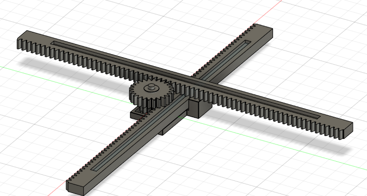

# 90° Direction Changing "reducer"

[Link to Fusion Project](https://a360.co/3J9H106)

### Specs Used

|Type|Gear/Rack Model.|Module|# of teeth|Gear pitch (mm)|shaft (mm)|# used|
|---|---|---|---|---|---|---|
|Gear|2662N27|0.5|12|6|2|x1
|Gear|2662N28|0.5|24|12|4|x1
|Rack|2662N55|0.5| |5.9| |x2|

### Successes
- Gears although small still works and can pull and push
- direction guides for rack works, w/ 0.1mm tolerance
- 3mm height shafts is barely functional, but still functional
  
### Failures
- base for holding the racks is poorly designed
  - need to secure the shafts
  - there will be a lot of force applied to the gear and the gear rotational axis
- the cylindar to hold the gear is too britle and too small in diameter
  - 3d printer is not that accurate for high pillars -> **need to buy rods* as replacement
    - or print the rods seperately
